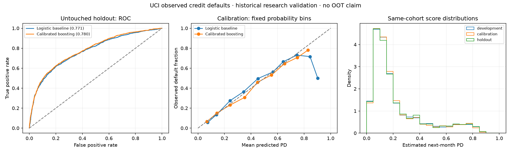

# Observed credit-default model validation

Historical public-data research case study. Model review status: **research only; no production approval**.

Source: [Yeh, I. (2009). Default of Credit Card Clients [Dataset]. UCI Machine Learning Repository. https://doi.org/10.24432/C55S3H.](https://archive.ics.uci.edu/dataset/350/default+of+credit+card+clients) · CC BY 4.0.

30,000 observed records; 6,636 observed defaults. Payment histories cover April–September 2005. Default means the publisher's next-month binary payment-default flag, not a harmonized regulatory default definition.

## Experiment design

Deterministic shuffled 5-fold stratified group split: three development folds, one calibration fold, one untouched holdout fold. Equal 19-predictor profiles share a group. Fold sizes are approximate 60/20/20, not dates or vintages.

Fixed logistic regression baseline and fixed histogram gradient boosting challenger. Logistic preprocessing and both estimators are fitted on development only. A sigmoid of the booster's log-odds is fitted on calibration only. The calibrated challenger is designated before holdout evaluation; no holdout tuning or champion selection occurs.

ID and SEX, EDUCATION, MARRIAGE, AGE are excluded from the 19 model predictors. Removing demographics alone does not establish fairness. Exact matching predictor profiles are assigned to the same partition, including conflicting observed outcomes.

| Partition | Records | Defaults | Observed default rate |
|---|---:|---:|---:|
| development | 18,000 | 3,982 | 22.12% |
| calibration | 6,000 | 1,327 | 22.12% |
| holdout | 6,000 | 1,327 | 22.12% |

## Holdout validation

| Model | AUC | KS | Brier | Log loss | Mean PD | O/E |
|---|---:|---:|---:|---:|---:|---:|
| constant_development_rate | 0.50000 | 0.00000 | 0.17225 | 0.52838 | 22.12% | 0.9997 |
| logistic | 0.77099 | 0.41905 | 0.13772 | 0.43979 | 22.39% | 0.9877 |
| gradient_boosting | 0.77986 | 0.42445 | 0.13529 | 0.43021 | 22.49% | 0.9835 |
| calibrated_gradient_boosting | 0.77986 | 0.42445 | 0.13538 | 0.43042 | 22.67% | 0.9756 |

Brier and log loss are proper probability scores that combine calibration and discrimination; the reliability table assesses calibration directly. O/E is observed defaults divided by summed estimated PD. Fixed 10-point probability bins include Wilson intervals in the JSON report.



### Uncertainty

Stratified percentile bootstrap; fixed class counts; conditional on fitted models and cohort; 300 resamples, 95% intervals.

- auc: [0.76365, 0.79300]
- ks: [0.40216, 0.45668]
- brier: [0.13153, 0.13974]
- auc_minus_logistic: [0.00234, 0.01652]
- brier_minus_logistic: [-0.00364, -0.00107]

## Stability and review findings

Score PSI, development to holdout: 0.002541. Bins use development quantiles and platform PSI smoothing 1e-6. These partitions share one historical cohort; this is sample stability, **not evidence of time drift or out-of-time performance**.

- **BLOCKER — One historical cohort cannot support out-of-time approval.** Acquire newer, dated cohorts and validate temporal and geographic transportability before any use.
- **REVIEW — Repayment statuses -2 and 0 occur outside UCI's described scale.** Preserved as source values; seek publisher/business definitions before operational adoption.
- **REVIEW — No independent reviewer approval or policy threshold.** Record independent model challenge, fairness review, and explicit decision authority before approval.
- **INFO — Holdout observed/expected defaults = 0.976.** Review reliability bins and uncertainty; training and calibration metrics are fitted diagnostics.
- **REVIEW — Calibration changes holdout Brier by +0.000081 versus the raw booster.** A positive change is worse. Calibration is not assumed to improve holdout performance; preserve both results for challenge.

## Interpretation boundaries

- Retail Taiwan credit-card cohort with 2005 histories; not current corporate or fund credit evidence.
- No dated application cohorts; no OOT or macroeconomic drift validation.
- Estimated next-month default probabilities are model outputs, not observed true PDs.
- No observed recoveries, LGD, EAD-at-default, collateral, trades, netting, margin or regulatory capital evidence; no expected-loss amount is asserted.
- Bootstrap intervals condition on fixed fitted models and class counts; they omit refitting, macro uncertainty and selection effects.
- Predictor-profile grouping mitigates exact duplicate leakage; household identities and unrecorded dependence are unavailable.
- Protected and demographic variables are excluded as predictors; a full fairness assessment remains outstanding.

## Reproduce and reconcile

```bash
.venv/bin/python scripts/run_public_credit_case_study.py --offline
.venv/bin/python -m pytest tests/test_credit_case_study.py
```

The CSV preserves source ID, observed outcome, fixed partition, predictor-group hash, and each estimated PD. `source_manifest.json` pins downloaded and workbook bytes. `artifact_manifest.json` hashes source code, inputs, predictions, charts and reports. `report.json` records versions, parameters, checks, bootstrap and model review findings. These are reproducibility checks, not an independent reviewer sign-off.

Holdout predicted defaults: 1360.18; observed defaults: 1327.
